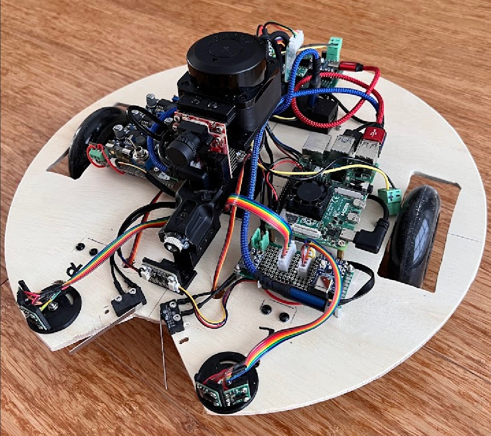
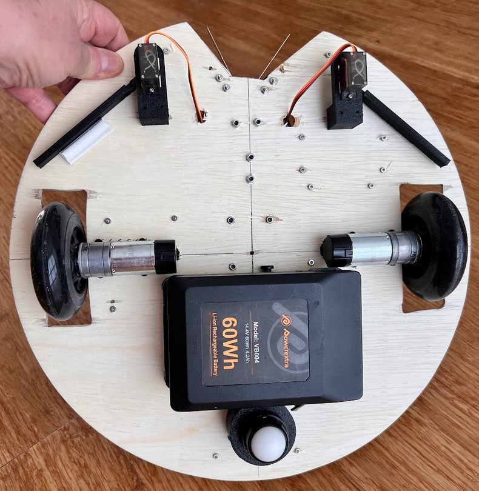
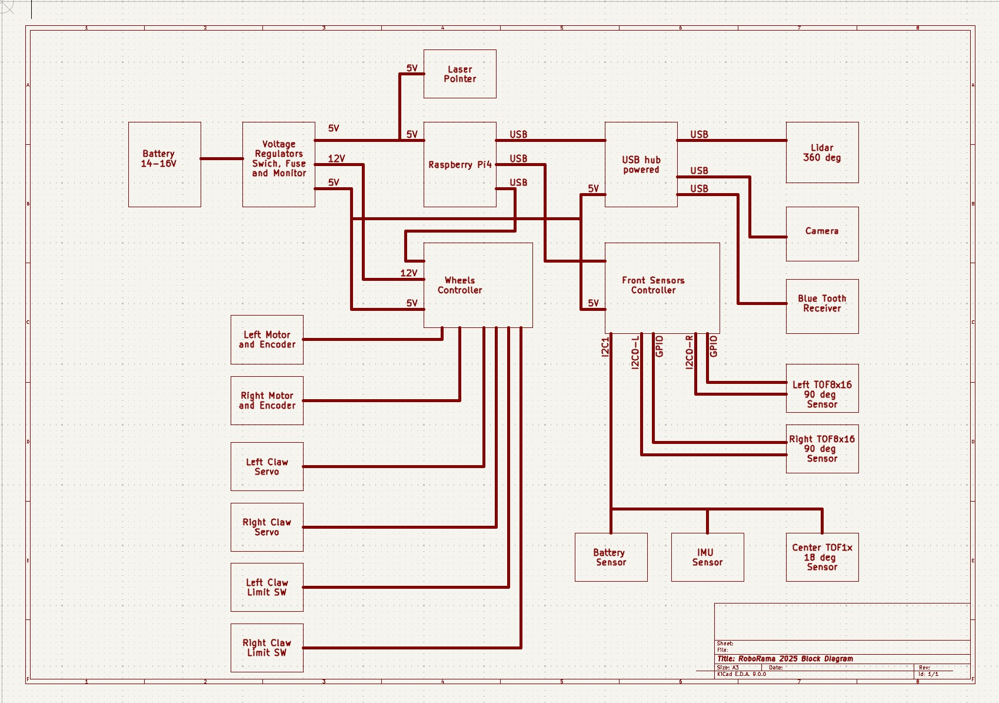
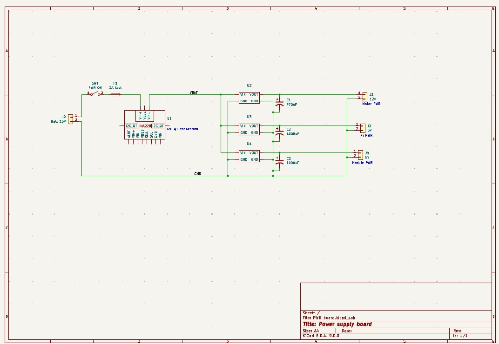
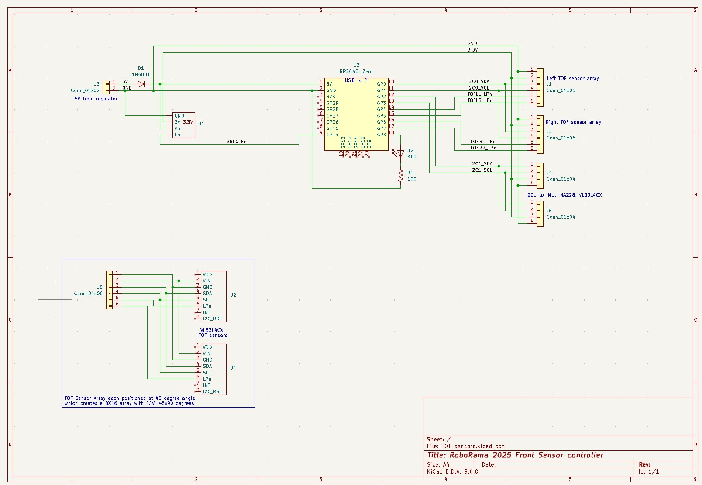
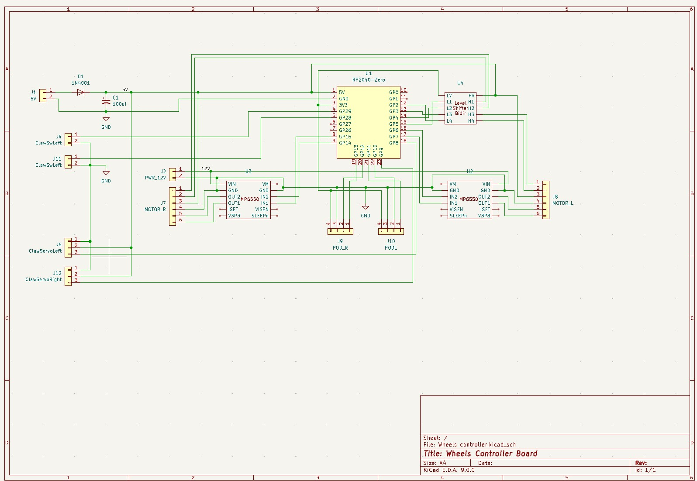

# DESCRIPTION
This ROS2 code is for the ROBORAMA 2025 Indoor robot competition<br>
The 2024 robot was stripped down and the motors, servos, camera, 3 VL53L5 sensors, IMU were reused as well as the power, wheel and sensor modules<br>
New wheels and a RPLidar C1 and another VL53L5 sensor and a VL53L4 sensor were added<br>
It has a new plywood base which is about 16" diameter (larger than my 3D printer can make)<br>
I am reusing and updating the wheel and sensor ROS2 modules<br>

## Pictures:
Top of robot:<br>
 <br>
Bottom of robot:<br>
 <br>

# Documentation
## Block diagram of electronics:
The Rasberry Pi does not supply power directly to any of the peripherals<br>
The peripheral power is supplied from the power supply module<br>
The powered USB hub supplies power for to the peripherals connected to it<br>
 <br>

## Schematics:
Power Supply board:<br>
There are 3 voltage regulators. 12V for the wheel motors. A 5V for the Pi and 5V for the peripherals<br>
The Peripheral 5V are bumped up 0.7 volts or so to compensate for the reverse protection diodes<br>
 <br>

Front Sensors Controller board:<br>
The 5V input has a reverse protection diode, the 5V input level is expected to be 5.7V or so to compensate for the diod drop. The 3.3V to the sensors is from a regulator since they need more power than the uC internal regulator can safely generate. The 3.3V regulator can be disabled to reset the VL53L4CX sensors before assigning I2C addresses. The RP2040 module 3.3V output is not used.<br>
The four VL53L4CX sensors are on the I2C0 bus and the I2C1 bus is a QT connector which connects to the other sensors.<br>
The wiring of the VL53L4CX sensors is shown on the schematic, this wiring is not on the Front Sensor Controller board.<br>
 <br>

Wheels Controller board:<br>
The 5V input has a reverse protection diode, the 5V input level is expected to be 5.7V or so to compensate for the diod drop. The RP2040 module 3.3V output powers the pod encoder sensors which do not require a lot of power.<br>
The 12V powers the MP6550 Wheel motor controllers which are connected with a 6 pin cable. The cable also has the motor encoder signals that are powered by 5V and the level shifter connects the signals to the 3.3V GPIO pins of the controller. There is also 4 pin connectors to pod odomtry sensors used on the 2024 robot but not this year.<br>
The 3 pin connectors are for the servos that control the claws operate on 5V and work with the 3.3V GPIO signals. There is a set 2 pin connectors for the limit switches that trip when the can is firmly gripped by the claws, the GPIO pins are configured with internal pull-up resistors so the switches pull the pin levels low when tripped.<br>
 <br>


# ROS2 node package Roborama25 Stuff
(NOTE: These descriptions are created using Co-Pilot)<br>
This package contains nodes and utilities for controlling and managing the Roborama25 robot.<br>

This command line compiles and launches the roborama25 project:<br>
clear; colcon build; source install/setup.bash ; ros2 launch roborama25_stuff roborama25_lc_nav2_bringup_launch.py

## Nodes

### `roborama25_wheel_controller_node_lc`

#### Description
The `roborama25_wheel_controller_node_lc` is a ROS 2 lifecycle node designed to control the robot's differential drive wheels and provide odometry data for the navigation stack. It communicates with a microcontroller (e.g., Raspberry Pi Pico) over a serial interface to send wheel velocity commands and receive encoder data.

#### Features
- **Lifecycle Management**: Implements lifecycle states (`on_configure`, `on_activate`, `on_deactivate`, `on_cleanup`, `on_shutdown`, `on_error`) to manage hardware connections and ROS 2 communications.
- **Wheel Control**: Converts `/cmd_vel` messages into individual wheel velocities and sends them to the microcontroller.
- **Odometry Calculation**: Processes encoder data to calculate the robot's position and orientation, publishing odometry data to the `/wheel_odom` topic.
- **TF Broadcasting**: Broadcasts the transform (`odom -> base_footprint`) using calculated odometry data.
- **Joystick Integration**: Supports joystick-based manual control for resetting encoders and controlling a claw mechanism.
- **Serial Communication**: Handles serial communication with the microcontroller for sending and receiving data.
- **Claw Control**: Processes JSON commands from the `/robot_json` topic to control a claw mechanism.

#### Topics
- **Subscriptions**:
  - `/cmd_vel`: Receives velocity commands for the robot.
  - `/joy`: Processes joystick inputs for additional controls.
  - `/robot_json`: Processes JSON commands for the claw mechanism.
  - `encoders_msg`: Reads encoder data from the serial interface.

- **Publications**:
  - `/wheel_odom`: Publishes odometry data for the navigation stack.
  - `encoders_msg`: Publishes raw encoder data received from the serial interface.
  - `wheel_debug_msg`: Publishes debug messages for wheel-related calculations.

#### Parameters
- **Wheel Configuration**:
  - `wheelDiameter`: Diameter of the wheels.
  - `wheelEncoderCounts`: Encoder counts per wheel rotation.
  - `wheelDistance`: Distance between the two wheels.

- **Velocity Limits**:
  - `wheelVelocityAccLimit`: Maximum acceleration for the wheels.
  - `fwdRevMpsMax`: Maximum forward/reverse speed.

- **Serial Configuration**:
  - `wheel_serial_port_name`: Serial port for communication with the microcontroller.
  - `serialTimerRateHz`: Frequency for checking the serial port.

#### Usage
1. Build the package:
   ```bash
   colcon build --packages-select roborama25_stuff